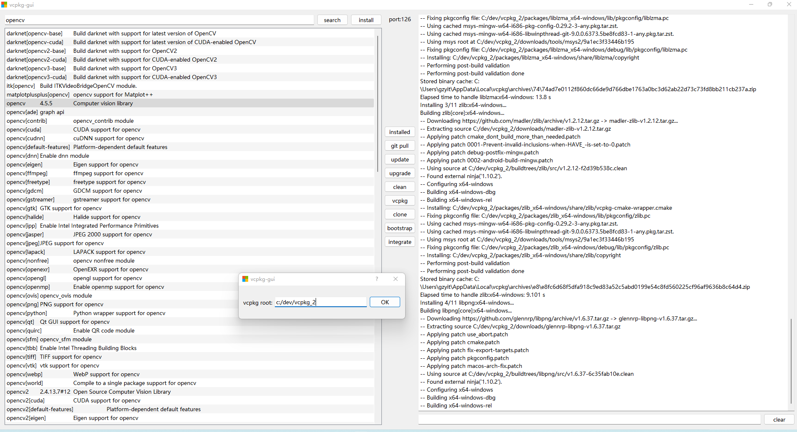
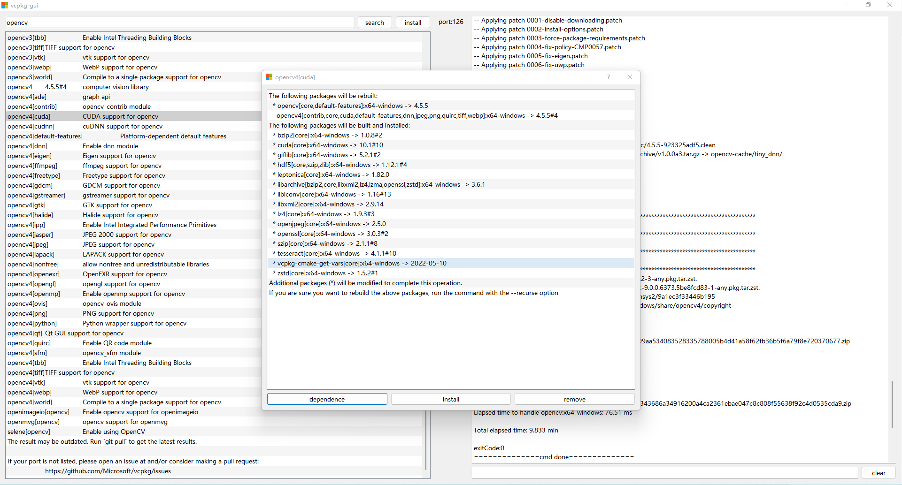

# vcpkg-gui

Author: :boy:Albert  :email:  15221024927@163.com, C/C++ software engineer.
>Topic: You can use Microsoft vcpkg package manager easily, with vcpkg-gui.
### Download and install

Download the installation package directly.
[release-v1.0.0](https://github.com/wwwwwalter/vcpkg-gui/releases)

### MainWindow

## :heartbeat: Welcome to contribute your wisdom to the repository.
**Some software you might use**

  * [Git](https://git-scm.com/docs)
  * [Fork](https://git-fork.com/)
  * [GitHub](https://docs.github.com/cn/get-started/quickstart/hello-world)
  * [Typora](https://pan.baidu.com/s/1L29j-3L2CfjRi2U7VFhT7Q?pwd=vc7p)
  * [Markdown](https://www.jianshu.com/p/191d1e21f7ed)

